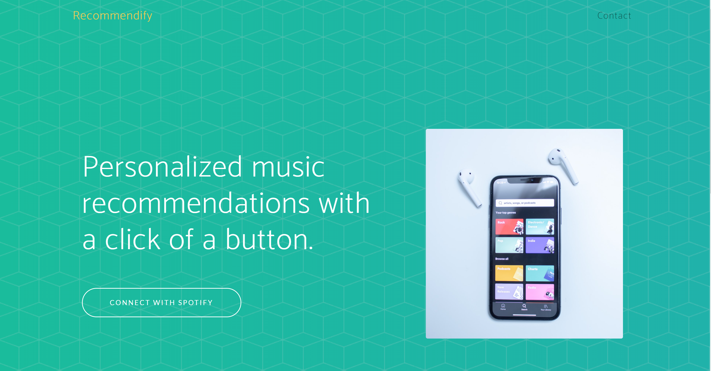

##Recommendify

> Discover new music!

Recommendify is a web application that allows users to get personalized music recommendations based on a particular genre, 
mood, or favorite track. 

The algorithm works by matching a user's particular input (e.g genre: pop) with a "seed" catalog of their top artists and tracks, in order to 
curate only the most relevant tracks. You can then preview individual songs, add the playlist to your Spotify library, and start listening to it right away!

## Spotify API
The application uses the following endpoints of the Spotify API:
 * [User Authorization](https://developer.spotify.com/documentation/general/guides/authorization-guide/)
 * [Search for an Item](https://developer.spotify.com/documentation/web-api/reference/search/search/)
 * [Get User Top Tracks/Artists](https://developer.spotify.com/documentation/web-api/reference/personalization/get-users-top-artists-and-tracks/)
 * [Get Artist Top Tracks](https://developer.spotify.com/documentation/web-api/reference/artists/get-artists-top-tracks/)
 * [Get Related Artists](https://developer.spotify.com/documentation/web-api/reference/artists/get-related-artists/)
 * [Seed Recommendations](https://developer.spotify.com/web-api/get-recommendations/)
 * [Create Playlist](https://developer.spotify.com/documentation/web-api/reference/playlists/create-playlist/)
 * [Add Tracks to a Playlist](https://developer.spotify.com/documentation/web-api/reference/playlists/add-tracks-to-playlist/)
 

### Stack
* Python/Flask
* Redis (Server-Side Caching)
* HTML/CSS/JS

###  License
